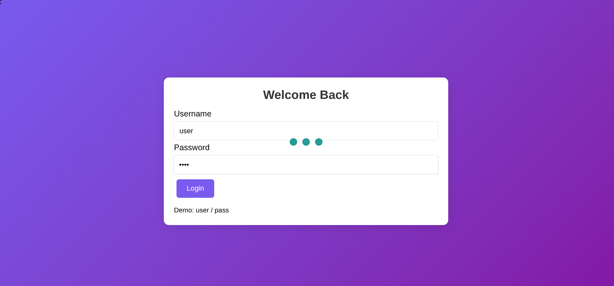
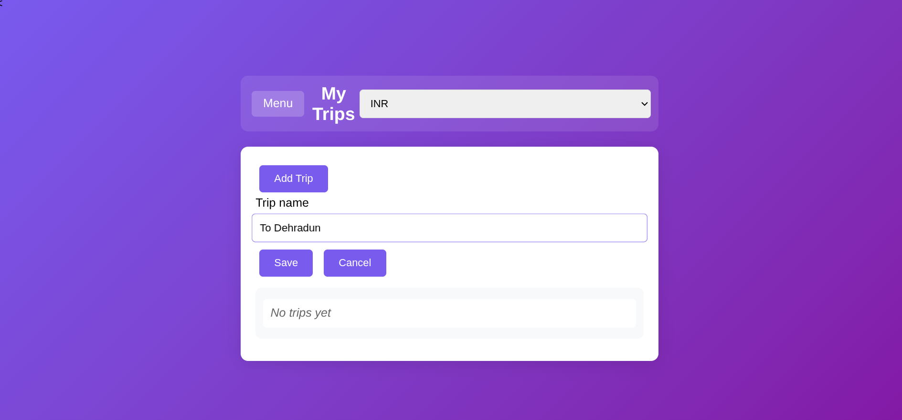
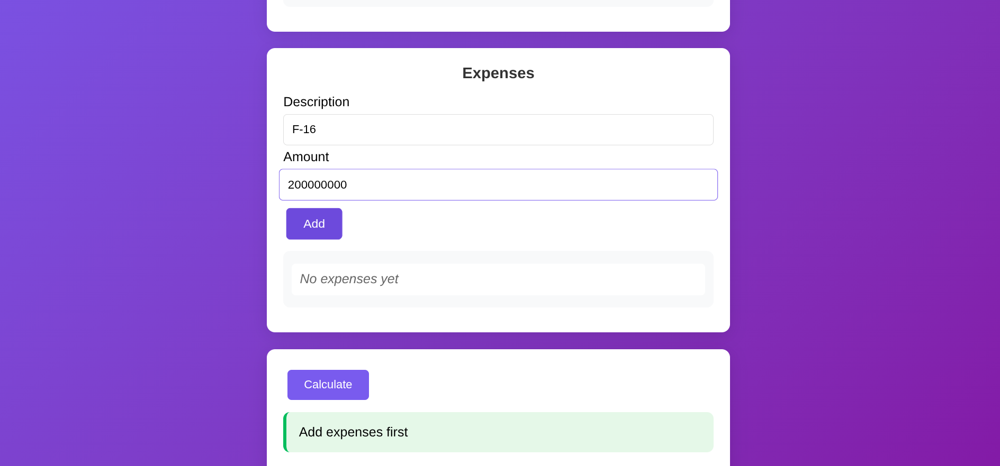
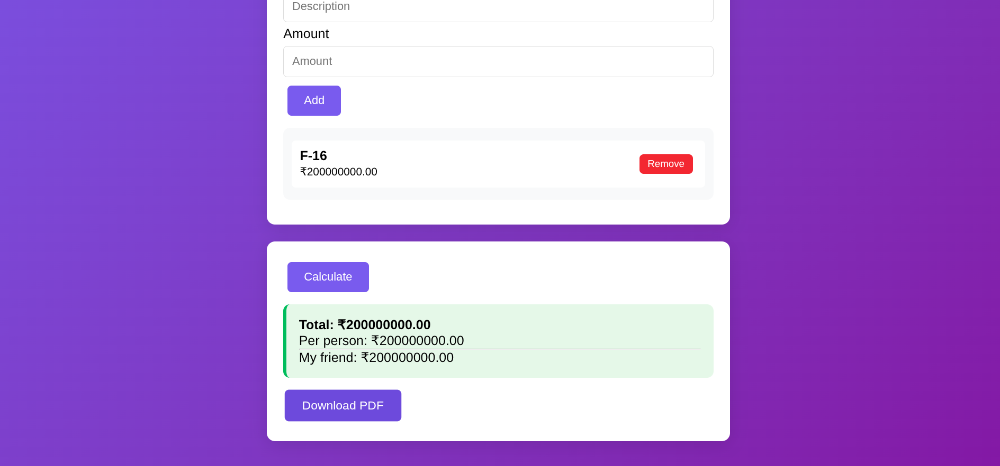

# Trip Splitter

Trip Splitter is a trip cost calculator that splits the total cost of a trip among attendees. It allows you to add trips, record expenses, assign who paid, and then automatically calculate how much each person owes. A detailed PDF report can also be generated.

----

## Features
- Login with a username and password (currently hardcoded: `user` / `pass`)
- Add new trips (e.g., "Dehradun Trip")
- Add attendees
- Add expenses with descriptions and assign the payer
- Calculate expenses and view charts showing per-person breakdown
- Download a PDF report with total expenses and account analysis

-------

## Walkthrough

### 1. Login
Use the hardcoded credentials:  
- Username: `user`  
- Password: `pass`

-------

### 2. Add a Trip
Click "Add Trip" and provide a trip name (e.g., "Dehradun").

---

### 3. Add People
Add the participants who are part of the trip.

----

### 4. Add Expenses
- Enter a description (e.g., "Lunch at Café")
- Enter the amount
- Select the person who paid from the dropdown

-------

### 5. Calculate and View Charts
Click "Calculate" to see the cost distribution.  
Charts will display the total and individual expenses.

----

### 6. Download PDF Report
Export a detailed PDF file with expenses and balances.

----

